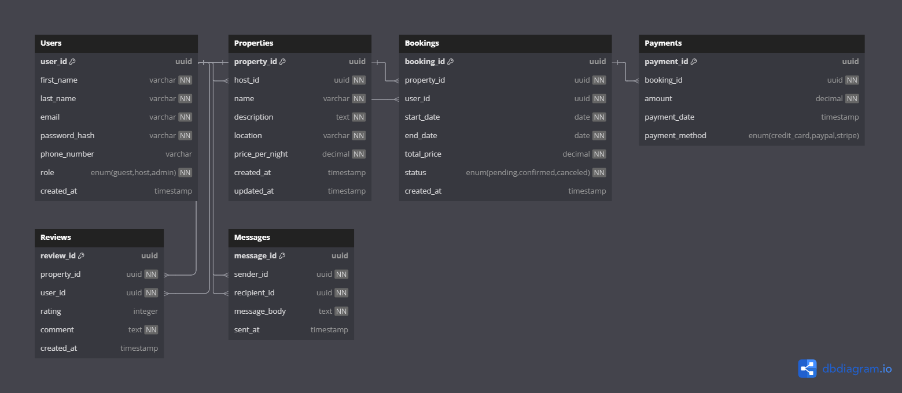
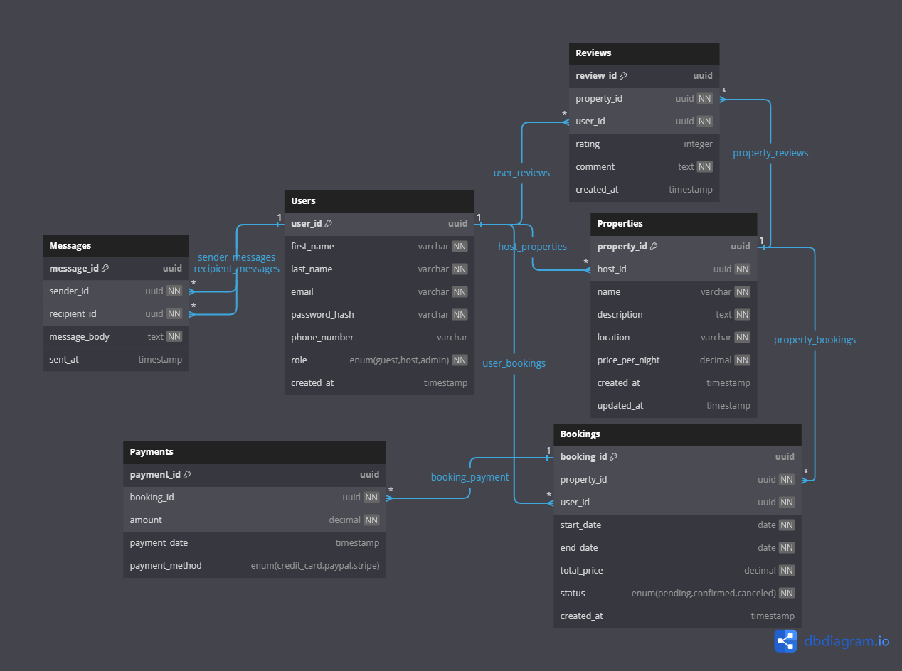

## Database Design (ERD)
Structure of the database adhering to normalization principles up to the third normal form (3NF).
<iframe width="560" height="315" src='https://www.dbdiagram.io/e/681f51385b2fc4582f0439b7/681f518c5b2fc4582f044162'> </iframe>

